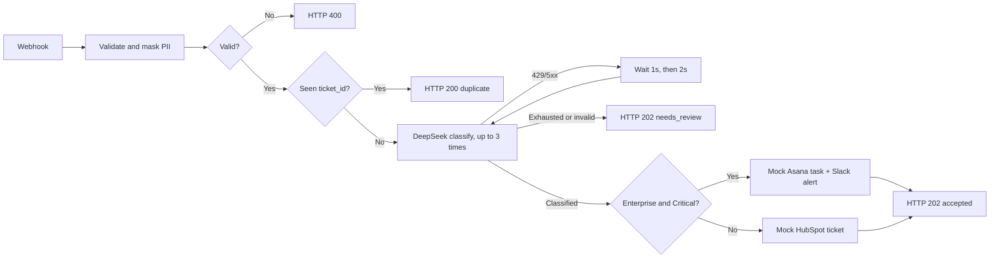

# AI Automation & Integration Engineer — take-home

Four blocks: an n8n ticket-routing workflow, a fixed Python RAG script, a PII-masking function, and a screen-recorded demo.

[Submission notes and architecture](https://colossal-dormouse-138.notion.site/AI-Automation-Integration-Engineer-Take-Home-Submission-3e294bb057aa81b5867bd651210055b2)

```
Makefile                                 make test / start / smoke / stop / reset
compose.yaml                             local n8n + its code runners
workflows/ticket-routing.json            Block 1 — the workflow
workflows/mock-model.json                Block 1 — test fixture standing in for the model API
src/rag.py                               Block 2
src/pii.py                               Block 3
tests/                                   workflow.test.mjs, test_pii.py, test_rag.py
```

```bash
make test
```

Offline, no Docker or keys: 19 Node tests walk the workflow JSON (structure, and every assignment scenario end to end through a small graph interpreter that runs the Code nodes — JavaScript in `vm`, Python via `python3` — with the model stubbed). The 18 Python tests split into 13 for `sanitize_pii` and 5 for the RAG script.

## Block 1 — n8n workflow

`POST /webhook/support-ticket` accepts `{ticket_id, customer_email, message, tier}`.



**Validation and masking.** `Validate and Mask PII` is a Python Code node whose code is [src/pii.py](src/pii.py) verbatim plus ~30 lines of n8n glue (field checks, the fault-injection header, the output item) — a test asserts the file is embedded byte for byte, so the masking rules exist once in the repository. The other Code nodes are JavaScript: n8n's native Python runner exposes only the incoming items, and dedupe, the retry counter and the classification normalizer need static data, `$runIndex` and other nodes' output.

**Duplicates.** `ticket_id` is the idempotency key. `Deduplicate Ticket` records each id in the workflow's static data (kept by n8n in its own database, 7-day TTL) before classification, so a repeated accepted webhook answers `200 duplicate` with no second model call, Asana task, or Slack alert. If classification falls back to `needs_review`, the response node releases the claim so the caller can retry. This is single-instance by nature; in production, claim the id in a database with a unique constraint or a cache with a TTL.

**Classification.** Only `sanitized_message` (PII already masked) goes to DeepSeek (`deepseek-flash`, `response_format: json_object`, `max_tokens: 256`). The prompt asks for `severity` in `Low | Medium | High | Critical` and a short `summary`; `Normalize Classification` re-validates the shape and the enum before anything acts on it. Measured on the sample ticket: ~130 prompt + ~20 completion tokens, ~0.7 s per call.

**Branching.** `tier == "Enterprise"` and `severity == "Critical"` → Asana + Slack mocks; everything else → HubSpot mock. Mocks build the payloads (`simulated: true`) and call nothing.

**Model outage (429 / 5xx).** Classification is a loop — `Classify Ticket → Normalize → Classified? → Retry? → Wait → Classify Ticket` — up to three attempts with 1 s then 2 s backoff on 429, 5xx, or a transport error. When the loop gives up, or the reply is malformed, the request returns `202 needs_review` and releases the dedupe claim so the caller can retry. A production version should additionally persist a durable review item for a human.

### Run it

```bash
make start   # docker compose up (n8n + runners), import and activate both workflows
make smoke   # 7 requests: critical, duplicate, standard, invalid, 429, 503, bad JSON
make stop    # keep n8n's data
make reset   # drop it (workflows, credentials, executions, dedupe state)
```

Open [http://localhost:5678](http://localhost:5678) (n8n asks for an owner account on first start) → *Support Ticket Routing* → *Executions* to see each request's path through the graph.

**DeepSeek key.** Lives in n8n only: Credentials → Add → DeepSeek, keep the default name `DeepSeek account`, then `make start` again — the export references the credential as `{"id": null, "name": "DeepSeek account"}` and n8n links it by name at import. Without it every valid ticket ends as `202 needs_review` after the three attempts.

**Reproducing an outage.** Add the header `X-Mock-Model-Status: 429` (or `503`, or `200` for a well-formed reply that is not JSON) to any request. `Classify Ticket` then calls `workflows/mock-model.json` — a three-node fixture on the same instance that answers with that status — instead of DeepSeek, so the retry loop shows up in Executions without spending tokens:

```bash
curl -X POST http://localhost:5678/webhook/support-ticket -H 'Content-Type: application/json' -H 'X-Mock-Model-Status: 429' \
  -d '{"ticket_id":"TK-429","customer_email":"a@b.com","message":"API down","tier":"Enterprise"}'
# {"status":"needs_review","ticket_id":"TK-429","reason":"model_unavailable","http_status":202}   after ~3 s
```

Three n8n details baked into the setup and guarded by tests or comments: the workflow id is `ticket-routing` because n8n only persists static data for ids of at most 21 characters; both Webhook nodes carry a `webhookId` because without one n8n registers the path as `<workflowId>/<node>/<path>`; and Code nodes run in the separate `n8nio/runners` container (the stock `n8n` image has no Python runner), whose bundled launcher config pins the Python stdlib allow-list to nothing — `compose.yaml` re-enables `re` with a one-line `sed` before starting the launcher.

The webhook has no authentication and n8n binds to `127.0.0.1` — a local demo; add auth before exposing it.

## Block 2 — RAG script fix

[src/rag.py](src/rag.py). Defects in the original snippet:

1. The function body is not indented — the script does not run.
2. `openai.Embedding.create` / `openai.ChatCompletion.create` are pre-v1 APIs; v1 uses `client.embeddings.create` and `client.chat.completions.create`.
3. `completion.choices[0].text` is the wrong path for Chat Completions — it is `.message.content`.
4. A key is hard-coded in the example call, and nothing handles exceptions.
5. The embedding is computed but never used for retrieval.
6. Raw customer text is sent to external services.

The fix: v1 client injected as a parameter (no key in code), the embedding passed to an injected retriever, PII masked in both the query and the retrieved context before any API call, empty input/context/answer rejected, API errors wrapped so request details never reach the user. A live run needs `pip install -r requirements.txt` and `OPENAI_API_KEY`; the tests use a fake client.

## Block 3 — PII masking

[src/pii.py](src/pii.py) — `sanitize_pii(text: str) -> str` for emails, international phone numbers, and Luhn-valid card numbers. The n8n `Validate and Mask PII` node embeds this file verbatim (see Block 1), so there is a single implementation.

```python
>>> sanitize_pii("Please contact John at john.smith@company.com or call +1-202-555-0143 regarding order #4412.")
'Please contact John at [REDACTED_EMAIL] or call [REDACTED_PHONE] regarding order #4412.'
```

Regex by design rather than libphonenumber: in strict mode the library misses both assignment examples (`+1-555-0199` is not a real number, `88005553535` needs a region), and in lenient mode it over-matches the same way a regex does. Masking errs on the safe side — a 10–15 digit run with phone-style separators (8+ after a `+`) is treated as a phone number, so long invoice numbers or IP addresses may be masked too; short references like `#4412`, `TK-9082`, `500 error` are left alone.

## Block 4 — screen recording

English Loom, microphone on, writing and testing `sanitize_pii` — linked in the submission email, not in this repository.
